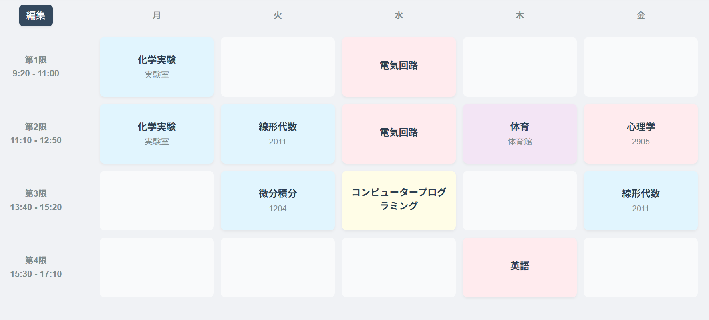
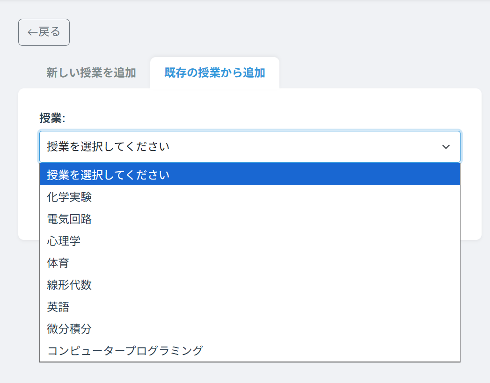
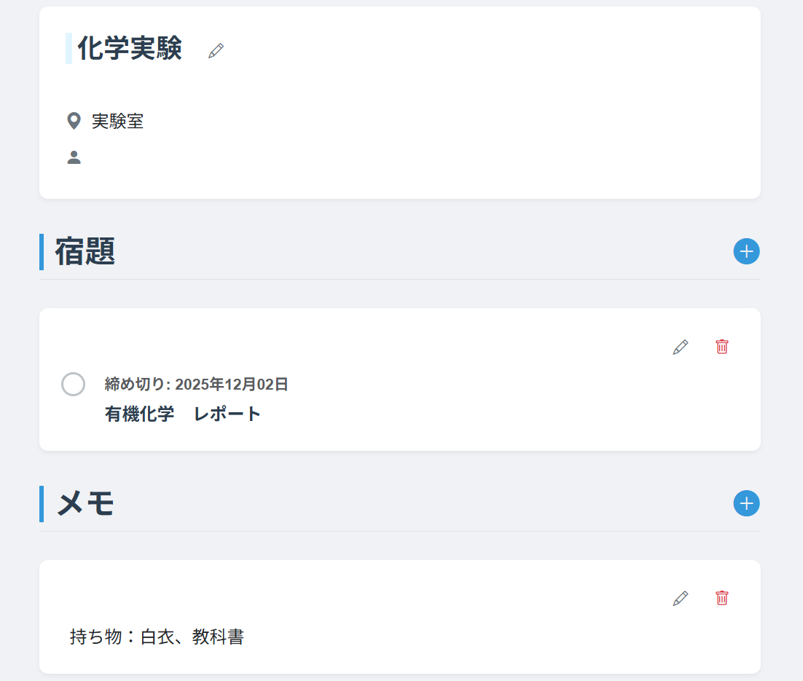
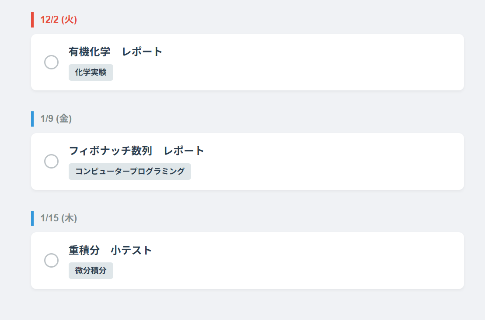

# (アプリ名)

## 概要

時間割を記録できるWEBアプリです。授業名、教室名、教授名、メモ、課題を保存できます。また、同一の授業を複数のコマに配置可能です。

## デプロイ先URL

https://your-app-url.com

## 機能

| 画面 | 機能概要 |
| :---: | :--- |
|  | **授業一覧** すべての授業を表示します。授業詳細画面や追加画面に移行できます。 |
|  | **授業追加** 新規授業を追加したり、既存の授業から選択して追加できます。 |
|  | **授業詳細** 選択した授業の情報を閲覧、編集できます。 |
|  | **課題一覧** すべての課題を閲覧し、完了済みかどうかを編集できます。 |

## 使用技術

| Category | Technology |
| :--- | :--- |
| **Language** |   |
| **Framework & Libs** |   |
| **Frontend** |    |
| **Database** |  |
| **Infrastructure** |   |

## なぜ作ったのか

本アプリは、大学のサークル活動の一環としてdjangoやweb開発の学習用に作成したものです。  
現在使用している時間割アプリに同一の授業を複数のコマに配置する機能が無かったため、題材を時間割アプリに決定しました。

## こだわったポイント

1. **レスポンシブ対応:** スマホでの利用を想定し、gridの大きさやフォントサイズなどを画面の大きさによって調整しました。
2. **授業の同期:** 同一の授業を複数のコマに配置する機能を実装しました。
3. **少ないページ更新:** Java Scriptのfetch APIを活用した非同期通信を用い、授業の追加、編集、削除の際にページ更新を挟まないストレスフルなアプリを目指しました。

## 苦労した点

* **Uzuki Alto**
  * **学習面:** djangoとcssはほぼ何も知らない状態からのスタートだったので、アプリの作成と平行しての学習が大変でした。djangoは[このサイト](https://str1ng-blog.vercel.app/)を参考にしました。
  * **レスポンシブ対応:** 授業一覧画面をスマートフォンの縦画面で見たときに縦に引き伸ばされてしまい、視認性と操作性のバランスが難しかったです。

## 今後の展望

* 追加したい機能
  * 課題一覧のソート機能
  * Google カレンダーとの連携
  * 時間割共有機能
  * 出席日数、欠席日数、遅刻回数の管理
* 修正したいこと
  * 課題一覧へのアクセスの悪さ

## 開発者

  

